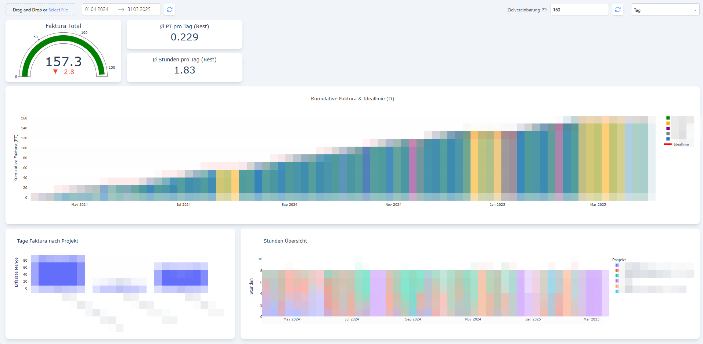

# Faktura Statistik Rechner

## Installation
### Python
- `Python >= 3.12` empfohlen: [https://www.python.org/downloads/](https://www.python.org/downloads/)
- Den environment Variablen hinzufügen, dass es in der Konsole verfügbar ist.

### Faktura Statistik
In Installationsordner navigieren (Pfad abhängig vom Installationsort):
```shell
cd "C:/FakturaStatistik"
```
Benötigte Python Pakete installieren:
```shell
pip install -r .\requirements.txt
```
In dash_app navigieren:
```shell
cd .\dash_app
```
Anwendung starten:
```shell
python .\app.py
```
Dashboard ist erreichbar unter: [http://127.0.0.1:8050/](http://127.0.0.1:8050/) 

## 